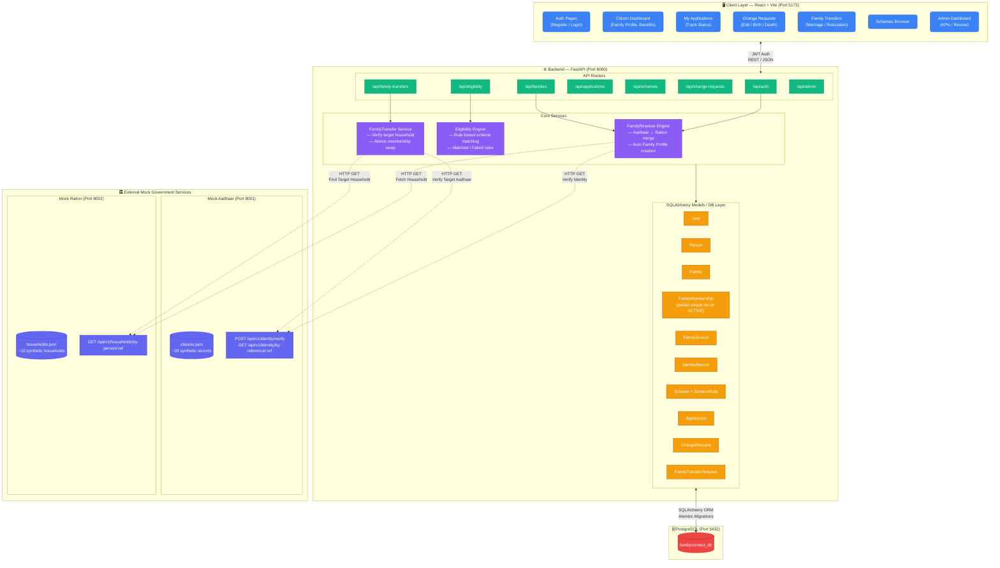
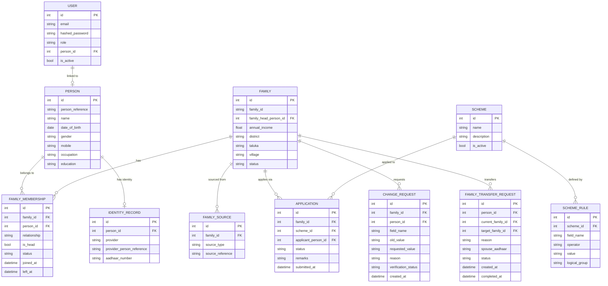
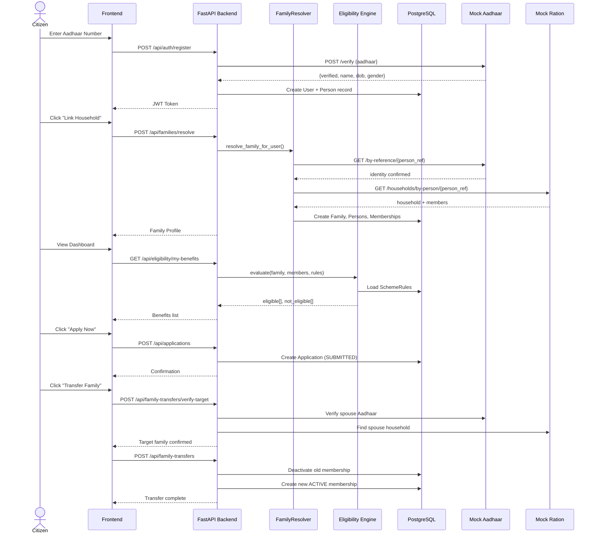
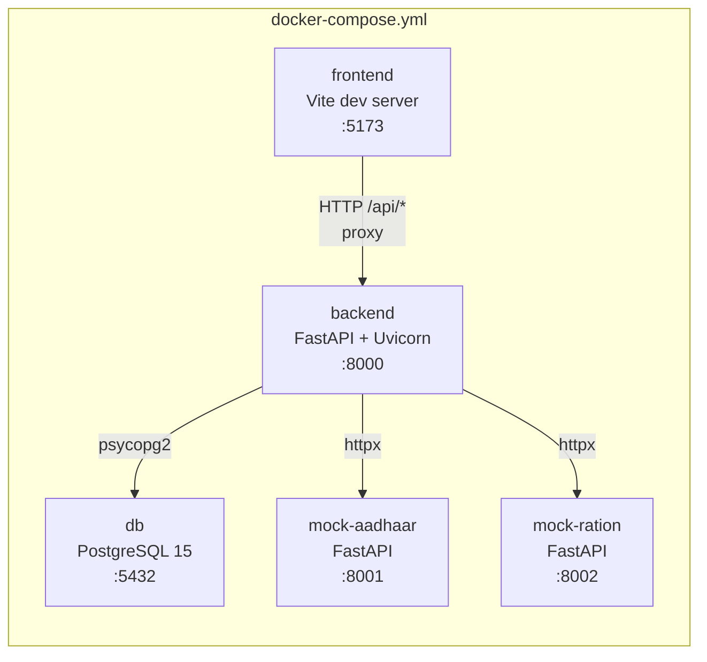

# FamilyConnect — Complete System Architecture

## 1. High-Level Architecture

```mermaid
graph TB
    subgraph CLIENT["🖥️ Client Layer — React + Vite (Port 5173)"]
        direction TB
        FE_AUTH["Auth Pages\n(Register / Login)"]
        FE_DASH["Citizen Dashboard\n(Family Profile, Benefits)"]
        FE_APPS["My Applications\n(Track Status)"]
        FE_CR["Change Requests\n(Edit / Birth / Death)"]
        FE_TR["Family Transfers\n(Marriage / Relocation)"]
        FE_SCH["Schemes Browser"]
        FE_ADMIN["Admin Dashboard\n(KPIs / Review)"]
    end

    subgraph BACKEND["⚙️ Backend — FastAPI (Port 8000)"]
        direction TB

        subgraph ROUTERS["API Routers"]
            R_AUTH["/api/auth"]
            R_FAM["/api/families"]
            R_ELI["/api/eligibility"]
            R_APP["/api/applications"]
            R_SCH["/api/schemes"]
            R_CR["/api/change-requests"]
            R_FT["/api/family-transfers"]
            R_ADM["/api/admin"]
        end

        subgraph SERVICES["Core Services"]
            SVC_RESOLVER["FamilyResolver Engine\n— Aadhaar ↔ Ration merge\n— Auto Family Profile creation"]
            SVC_ELIG["Eligibility Engine\n— Rule-based scheme matching\n— Matched / Failed rules"]
            SVC_TRANSFER["FamilyTransfer Service\n— Verify target household\n— Atomic membership swap"]
        end

        subgraph MODELS["SQLAlchemy Models / DB Layer"]
            M_USER["User"]
            M_PERSON["Person"]
            M_FAMILY["Family"]
            M_FM["FamilyMembership\n(partial unique idx on ACTIVE)"]
            M_FS["FamilySource"]
            M_ID["IdentityRecord"]
            M_SCHEME["Scheme + SchemeRule"]
            M_APP["Application"]
            M_CR["ChangeRequest"]
            M_FTR["FamilyTransferRequest"]
        end
    end

    subgraph DB["🗄️ PostgreSQL (Port 5432)"]
        PGDB[("familyconnect_db")]
    end

    subgraph EXT["🏛️ External Mock Government Services"]
        direction LR
        subgraph AADHAAR["Mock Aadhaar (Port 8001)"]
            AA_DATA[("citizens.json\n~29 synthetic records")]
            AA_API["POST /api/v1/identity/verify\nGET /api/v1/identity/by-reference/:ref"]
        end
        subgraph RATION["Mock Ration (Port 8002)"]
            RAT_DATA[("households.json\n~10 synthetic households")]
            RAT_API["GET /api/v1/households/by-person/:ref"]
        end
    end

    %% Client ↔ Backend
    CLIENT <-->|"JWT Auth\nREST / JSON"| ROUTERS

    %% Routers ↔ Services
    R_AUTH --> SVC_RESOLVER
    R_FAM --> SVC_RESOLVER
    R_ELI --> SVC_ELIG
    R_FT --> SVC_TRANSFER

    %% Services ↔ Models
    SERVICES --> MODELS

    %% Models ↔ DB
    MODELS <-->|"SQLAlchemy ORM\nAlembic Migrations"| PGDB

    %% Services ↔ External APIs
    SVC_RESOLVER -.->|"HTTP GET\nVerify Identity"| AA_API
    SVC_RESOLVER -.->|"HTTP GET\nFetch Household"| RAT_API
    SVC_TRANSFER -.->|"HTTP GET\nVerify Target Aadhaar"| AA_API
    SVC_TRANSFER -.->|"HTTP GET\nFind Target Household"| RAT_API

    %% Styling
    classDef client fill:#3b82f6,stroke:#1d4ed8,color:#fff,rx:8
    classDef router fill:#10b981,stroke:#059669,color:#fff
    classDef service fill:#8b5cf6,stroke:#6d28d9,color:#fff
    classDef model fill:#f59e0b,stroke:#b45309,color:#fff
    classDef db fill:#ef4444,stroke:#b91c1c,color:#fff
    classDef ext fill:#6366f1,stroke:#4338ca,color:#fff

    class FE_AUTH,FE_DASH,FE_APPS,FE_CR,FE_TR,FE_SCH,FE_ADMIN client
    class R_AUTH,R_FAM,R_ELI,R_APP,R_SCH,R_CR,R_FT,R_ADM router
    class SVC_RESOLVER,SVC_ELIG,SVC_TRANSFER service
    class M_USER,M_PERSON,M_FAMILY,M_FM,M_FS,M_ID,M_SCHEME,M_APP,M_CR,M_FTR model
    class PGDB db
    class AA_DATA,AA_API,RAT_DATA,RAT_API ext
```

---

## 2. Database Schema

```mermaid
erDiagram
    USER {
        int id PK
        string email
        string hashed_password
        string role
        int person_id FK
        bool is_active
    }
    PERSON {
        int id PK
        string person_reference
        string name
        date date_of_birth
        string gender
        string mobile
        string occupation
        string education
    }
    FAMILY {
        int id PK
        string family_id
        int family_head_person_id FK
        float annual_income
        string district
        string taluka
        string village
        string status
    }
    FAMILY_MEMBERSHIP {
        int id PK
        int family_id FK
        int person_id FK
        string relationship
        bool is_head
        string status
        datetime joined_at
        datetime left_at
    }
    FAMILY_SOURCE {
        int id PK
        int family_id FK
        string source_type
        string source_reference
    }
    IDENTITY_RECORD {
        int id PK
        int person_id FK
        string provider
        string provider_person_reference
        string aadhaar_number
    }
    SCHEME {
        int id PK
        string name
        string description
        bool is_active
    }
    SCHEME_RULE {
        int id PK
        int scheme_id FK
        string field_name
        string operator
        string value
        string logical_group
    }
    APPLICATION {
        int id PK
        int family_id FK
        int scheme_id FK
        int applicant_person_id FK
        string status
        string remarks
        datetime submitted_at
    }
    CHANGE_REQUEST {
        int id PK
        int family_id FK
        int person_id FK
        string field_name
        string old_value
        string requested_value
        string reason
        string verification_status
        datetime created_at
    }
    FAMILY_TRANSFER_REQUEST {
        int id PK
        int person_id FK
        int current_family_id FK
        int target_family_id FK
        string reason
        string spouse_aadhaar
        string status
        datetime created_at
        datetime completed_at
    }

    USER ||--o| PERSON : "linked to"
    PERSON ||--o{ FAMILY_MEMBERSHIP : "belongs to"
    FAMILY ||--o{ FAMILY_MEMBERSHIP : "has"
    FAMILY ||--o{ FAMILY_SOURCE : "sourced from"
    FAMILY ||--o{ APPLICATION : "applies via"
    FAMILY ||--o{ CHANGE_REQUEST : "requests"
    FAMILY ||--o{ FAMILY_TRANSFER_REQUEST : "transfers"
    PERSON ||--o| IDENTITY_RECORD : "has identity"
    SCHEME ||--o{ SCHEME_RULE : "defined by"
    SCHEME ||--o{ APPLICATION : "applied to"
```

---

## 3. Citizen Flow (Sequence)

```mermaid
sequenceDiagram
    actor Citizen
    participant Frontend
    participant API as FastAPI Backend
    participant Resolver as FamilyResolver
    participant Eligibility as Eligibility Engine
    participant DB as PostgreSQL
    participant Aadhaar as Mock Aadhaar
    participant Ration as Mock Ration

    %% Registration / Login
    Citizen->>Frontend: Enter Aadhaar Number
    Frontend->>API: POST /api/auth/register
    API->>Aadhaar: POST /verify {aadhaar}
    Aadhaar-->>API: {verified, name, dob, gender}
    API->>DB: Create User + Person record
    API-->>Frontend: JWT Token

    %% Family Resolution
    Citizen->>Frontend: Click "Link Household"
    Frontend->>API: POST /api/families/resolve
    API->>Resolver: resolve_family_for_user()
    Resolver->>Aadhaar: GET /by-reference/{person_ref}
    Aadhaar-->>Resolver: identity confirmed
    Resolver->>Ration: GET /households/by-person/{person_ref}
    Ration-->>Resolver: household + members
    Resolver->>DB: Create Family, Persons, Memberships
    API-->>Frontend: Family Profile

    %% Eligibility
    Citizen->>Frontend: View Dashboard
    Frontend->>API: GET /api/eligibility/my-benefits
    API->>Eligibility: evaluate(family, members, rules)
    Eligibility->>DB: Load SchemeRules
    Eligibility-->>API: eligible[], not_eligible[]
    API-->>Frontend: Benefits list

    %% Application
    Citizen->>Frontend: Click "Apply Now"
    Frontend->>API: POST /api/applications
    API->>DB: Create Application (SUBMITTED)
    API-->>Frontend: Confirmation

    %% Family Transfer
    Citizen->>Frontend: Click "Transfer Family"
    Frontend->>API: POST /api/family-transfers/verify-target
    API->>Aadhaar: Verify spouse Aadhaar
    API->>Ration: Find spouse household
    API-->>Frontend: Target family confirmed
    Frontend->>API: POST /api/family-transfers
    API->>DB: Deactivate old membership
    API->>DB: Create new ACTIVE membership
    API-->>Frontend: Transfer complete
```

---

## 4. Docker Compose Services

```mermaid
graph LR
    subgraph Docker["docker-compose.yml"]
        SVC_FE["frontend\nVite dev server\n:5173"]
        SVC_BE["backend\nFastAPI + Uvicorn\n:8000"]
        SVC_DB["db\nPostgreSQL 15\n:5432"]
        SVC_AA["mock-aadhaar\nFastAPI\n:8001"]
        SVC_RAT["mock-ration\nFastAPI\n:8002"]
    end

    SVC_FE -->|"HTTP /api/*\nproxy"| SVC_BE
    SVC_BE -->|"psycopg2"| SVC_DB
    SVC_BE -->|"httpx"| SVC_AA
    SVC_BE -->|"httpx"| SVC_RAT
```
